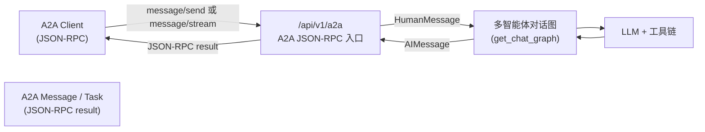

# A2A JSON-RPC 使用说明

## 概述

本说明文档介绍 cus-ai-agent 中实现的 **A2A JSON-RPC HTTP 接口**，用于通过 A2A 协议调用智能体：

- 通过 JSON-RPC 2.0 发送 `message/send` 请求，获得一次性的完整回答
- 通过 JSON-RPC 2.0 发送 `message/stream` 请求，使用 SSE（Server-Sent Events）获取流式增量结果
- 由服务内部的多智能体对话图处理问题
- 返回符合 A2A 协议结构的 `Message` / 流式 Task 结果

当前实现支持同步 `message/send` 和流式 `message/stream`，对 `tasks/get` 与 `tasks/cancel` 仍为占位实现（始终返回 TaskNotFound / TaskNotCancelable 错误）。

## 接口地址与架构

### HTTP 入口

- **URL**: `POST /api/v1/a2a`
- **Content-Type**: `application/json`
- **协议**: JSON-RPC 2.0

建议在 AgentCard 中配置：

```json
{
  "url": "http://<host>:8000/api/v1/a2a",
  "preferredTransport": "JSONRPC"
}
```

### 调用链路架构



## 支持的方法

当前 `/a2a/v1` 实现了以下 JSON-RPC 方法：

### 1. `message/send`（一次性结果）

- **用途**：向智能体发送一条消息，请求一次性完整回答
- **入参示例**：

```json
{
  "jsonrpc": "2.0",
  "id": "1",
  "method": "message/send",
  "params": {
    "message": {
      "role": "user",
      "parts": [
        { "kind": "text", "text": "你的问题文本" }
      ]
    },
    "metadata": {}
  }
}
```

- **返回示例（精简）**：

```json
{
  "jsonrpc": "2.0",
  "id": "1",
  "result": {
    "messageId": "...",
    "contextId": "...",
    "parts": [
      { "kind": "text", "text": "智能体回答内容" }
    ],
    "kind": "message",
    "metadata": {}
  }
}
```

### 2. `message/stream`（SSE 流式结果）

- **用途**：获取增量 token / 消息更新，适合长输出、需要实时反馈的场景
- **调用方式**：`POST /api/v1/a2a`，JSON-RPC `method` 为 `message/stream`，HTTP 层返回 `Content-Type: text/event-stream`。

#### 请求示例

```http
POST /api/v1/a2a
Content-Type: application/json

{
  "jsonrpc": "2.0",
  "id": "stream-1",
  "method": "message/stream",
  "params": {
    "message": {
      "role": "user",
      "parts": [
        { "kind": "text", "text": "请分点回答：如何写一个 A2A JSON-RPC 流式接口？" }
      ]
    },
    "metadata": {
      "trace_id": "abc-123"
    }
  }
}
```

#### SSE 响应结构（概念示意）

- HTTP 头：`Content-Type: text/event-stream`
- 响应体：多条以 `data: ...\n\n` 形式发送的 SSE 事件
- 每条 `data` 都是一个 **JSON-RPC Response** 对象，例如：

```text
data: {"jsonrpc":"2.0","id":"stream-1","result":{...}}
data: {"jsonrpc":"2.0","id":"stream-1","result":{...}}
...
data: [DONE]
```

其中 `result` 采用简化版 A2A 结构：

- `task`: 当前任务状态（包含 `id`、`state`、`contextId`）
- `events`: 事件列表，目前只有一种：`TaskStatusUpdateEvent`
  - 中间事件：`state="working"`，`final=false`，包含 `messageDelta`
  - 最终事件：`state="completed"`，`final=true`，包含完整 `message`

中间事件示例（单条 token 增量）：

```json
{
  "jsonrpc": "2.0",
  "id": "stream-1",
  "result": {
    "task": { "id": "task-xxx", "state": "working", "contextId": "session-xxx" },
    "events": [
      {
        "type": "TaskStatusUpdateEvent",
        "taskId": "task-xxx",
        "state": "working",
        "final": false,
        "messageDelta": {
          "messageId": "msg-xxx",
          "contextId": "session-xxx",
          "parts": [ { "kind": "text", "text": "当前增量 token ..." } ]
        }
      }
    ],
    "final": false
  }
}
```

流结束时会额外发送一条 `data: [DONE]` 作为结束标记。

#### Python 客户端消费示例

```python
import json
import requests

payload = {
    "jsonrpc": "2.0",
    "id": "stream-1",
    "method": "message/stream",
    "params": {
        "message": {
            "role": "user",
            "parts": [
                {"kind": "text", "text": "请用三点回答：如何通过 A2A 流式调用你？"}
            ],
        },
        "metadata": {},
    },
}

with requests.post("http://127.0.0.1:8000/api/v1/a2a", json=payload, stream=True) as resp:
    resp.raise_for_status()
    full = []
    for raw in resp.iter_lines():
        if not raw:
            continue
        line = raw.decode("utf-8")
        if not line.startswith("data: "):
            continue
        data = line[6:]
        if data == "[DONE]":
            break
        event = json.loads(data)
        result = event.get("result") or {}
        events = result.get("events") or []
        for e in events:
            delta = (e.get("messageDelta") or {}).get("parts", [])
            for part in delta:
                if part.get("kind") == "text":
                    text = part.get("text", "")
                    full.append(text)
                    print(text, end="", flush=True)

    print("\n\n--- 完整回答 ---")
    print("".join(full))
```

### 3. `tasks/get`（接口存在，当前总是 TaskNotFound）

- 目的：符合 A2A 规范对 `tasks/get` 的要求
- 目前由于没有任务持久化，统一返回：`code = -32001`（TaskNotFoundError）

### 4. `tasks/cancel`（接口存在，当前总是不可取消）

- 目的：符合 A2A 规范对 `tasks/cancel` 的要求
- 当前实现不支持任务取消，统一返回：`code = -32002`（TaskNotCancelableError）

## 错误码与行为说明

实现中遵循 JSON-RPC 2.0 与 A2A 的错误约定：

| 场景 | code | message | 说明 |
|------|------|---------|------|
| `jsonrpc` 不是 `"2.0"` | -32600 | Invalid Request | JSON-RPC 协议版本不正确 |
| `method` 未实现 | -32601 | Method not found | 未知方法，例如 `"foo/bar"` |
| `params` 不是对象、字段缺失或类型错误 | -32602 | Invalid params | 由 Pydantic 校验错误给出具体原因 |
| 内部异常 | -32603 | Internal error | 服务内部错误（会记录日志） |
| `tasks/get` | -32001 | Task not found | 当前实现中不存在可查询任务 |
| `tasks/cancel` | -32002 | Task cannot be canceled | 当前实现不支持取消任务 |

## 与 AgentCard 的关系

- 推荐在 AgentCard 中：
  - `preferredTransport`: `"JSONRPC"`
  - `url`: 指向本服务的 `/a2a/v1`
  - `defaultInputModes`: 至少包含 `"application/json"`
  - `defaultOutputModes`: 至少包含 `"application/json"`
  - `capabilities.streaming`: `true`（表示支持 message/stream SSE 流式推送）
- A2A 客户端（或上游代理）应：
  1. 通过 Nacos A2A Registry 获取 AgentCard
  2. 读取 `preferredTransport` 与 `url`、`capabilities.streaming`
  3. 如果是 JSONRPC，则按本文所述格式构造 JSON-RPC 请求；当需要流式结果时使用 `message/stream`

这样即可实现：

> 通过 A2A 注册中心发现 cus-ai-agent 智能体 → 根据 AgentCard.url 调用 `/a2a/v1` → 通过 JSON-RPC `message/send` 或 `message/stream` 进行同步/流式对话并获取回复。

