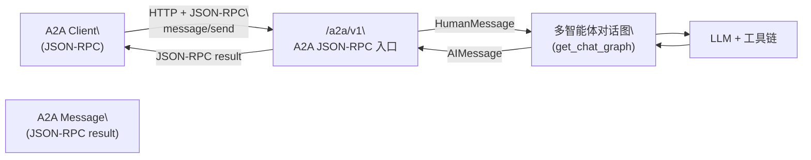

# A2A JSON-RPC 使用说明

## 概述

本说明文档介绍 cus-ai-agent 中实现的 **A2A JSON-RPC HTTP 接口**，用于通过 A2A 协议调用智能体：

- 通过 JSON-RPC 2.0 发送 `message/send` 请求
- 由服务内部的多智能体对话图处理问题
- 返回符合 A2A 协议结构的 `Message` 结果

当前实现聚焦最核心的同步对话场景，暂未实现完整的任务持久化与取消逻辑。

## 接口地址与架构

### HTTP 入口

- **URL**: `POST /a2a/v1`
- **Content-Type**: `application/json`
- **协议**: JSON-RPC 2.0

建议在 AgentCard 中配置：

```json
{
  "url": "http://<host>:8000/a2a/v1",
  "preferredTransport": "JSONRPC"
}
```

### 调用链路架构



## 支持的方法

当前 /a2a/v1 实现了以下 JSON-RPC 方法：

### 1. `message/send`（已实现，推荐使用）

- **用途**：向智能体发送一条消息，请求回答
- **入参**（简化版，与 A2A 规范对齐）：

```json
{
  "jsonrpc": "2.0",
  "id": "1",
  "method": "message/send",
  "params": {
    "message": {
      "role": "user",
      "parts": [
        { "kind": "text", "text": "你的问题文本" }
      ]
    },
    "metadata": {}
  }
}
```

- **关键字段说明**：
  - `message.role`: 当前实现主要使用 `user`
  - `message.parts`: 
    - 只支持 `kind="text"` 的文本 part
    - 至少包含一个非空 `text`
  - `metadata`: 可选，自定义元数据

- **返回结果**（成功时 `result.kind = "message"`）：

```json
{
  "jsonrpc": "2.0",
  "id": "1",
  "result": {
    "messageId": "...",
    "contextId": "...",
    "parts": [
      { "kind": "text", "text": "智能体回答内容" }
    ],
    "kind": "message",
    "metadata": {}
  }
}
```

### 2. `tasks/get`（接口存在，当前总是 TaskNotFound）

- 目的：符合 A2A 规范对 `tasks/get` 的要求
- 目前由于没有任务持久化，统一返回 A2A 特定错误：
  - `code = -32001`（TaskNotFoundError）

### 3. `tasks/cancel`（接口存在，当前总是不可取消）

- 目的：符合 A2A 规范对 `tasks/cancel` 的要求
- 当前实现不支持任务取消，统一返回：
  - `code = -32002`（TaskNotCancelableError）

## 调用示例

### 1. 使用 curl 调用 message/send

```bash
curl -X POST "http://127.0.0.1:8000/a2a/v1" \
  -H "Content-Type: application/json" \
  -d '{
    "jsonrpc": "2.0",
    "id": "1",
    "method": "message/send",
    "params": {
      "message": {
        "role": "user",
        "parts": [
          {
            "kind": "text",
            "text": "通过 A2A 调用你，请用一句话介绍一下自己？"
          }
        ]
      },
      "metadata": {}
    }
  }'
```

返回示例（精简）：

```json
{
  "jsonrpc": "2.0",
  "id": "1",
  "result": {
    "messageId": "...",
    "contextId": "...",
    "parts": [
      { "kind": "text", "text": "你好，我是基于 LangGraph 的多智能体系统，用于对话和知识检索。" }
    ],
    "kind": "message",
    "metadata": {}
  }
}
```

### 2. Python 客户端示例

```python
import requests

payload = {
    "jsonrpc": "2.0",
    "id": "1",
    "method": "message/send",
    "params": {
        "message": {
            "role": "user",
            "parts": [
                {"kind": "text", "text": "你好，通过 A2A 问你一个问题：1+1 等于几？"}
            ],
        },
        "metadata": {},
    },
}

resp = requests.post("http://127.0.0.1:8000/a2a/v1", json=payload, timeout=30)
resp.raise_for_status()
result = resp.json()["result"]
answer = result["parts"][0]["text"]
print("A2A answer:", answer)
```

## 错误码与行为说明

实现中遵循 JSON-RPC 2.0 与 A2A 的错误约定：

| 场景 | code | message | 说明 |
|------|------|---------|------|
| `jsonrpc` 不是 `"2.0"` | -32600 | Invalid Request | JSON-RPC 协议版本不正确 |
| `method` 未实现 | -32601 | Method not found | 未知方法，例如 `"foo/bar"` |
| `params` 不是对象、字段缺失或类型错误 | -32602 | Invalid params | 由 Pydantic 校验错误给出具体原因 |
| 内部异常 | -32603 | Internal error | 服务内部错误（会记录日志） |
| `tasks/get` | -32001 | Task not found | 当前实现中不存在可查询任务 |
| `tasks/cancel` | -32002 | Task cannot be canceled | 当前实现不支持取消任务 |

错误响应示例：

```json
{
  "jsonrpc": "2.0",
  "id": "1",
  "error": {
    "code": -32601,
    "message": "Method not found",
    "data": null
  }
}
```

## 与 AgentCard 的关系

- 推荐在 AgentCard 中：
  - `preferredTransport`: `"JSONRPC"`
  - `url`: 指向本服务的 `/a2a/v1`
  - `defaultInputModes`: 至少包含 `"application/json"`
  - `defaultOutputModes`: 至少包含 `"application/json"`
- A2A 客户端（或上游代理）应：
  1. 通过 Nacos A2A Registry 获取 AgentCard
  2. 读取 `preferredTransport` 与 `url`
  3. 如果是 JSONRPC，则按本文所述格式构造 JSON-RPC 请求

这样即可实现：

> 通过 A2A 注册中心发现 cus-ai-agent 智能体 → 根据 AgentCard.url 调用 `/a2a/v1` → 通过 JSON-RPC `message/send` 询问问题并获取回复。

