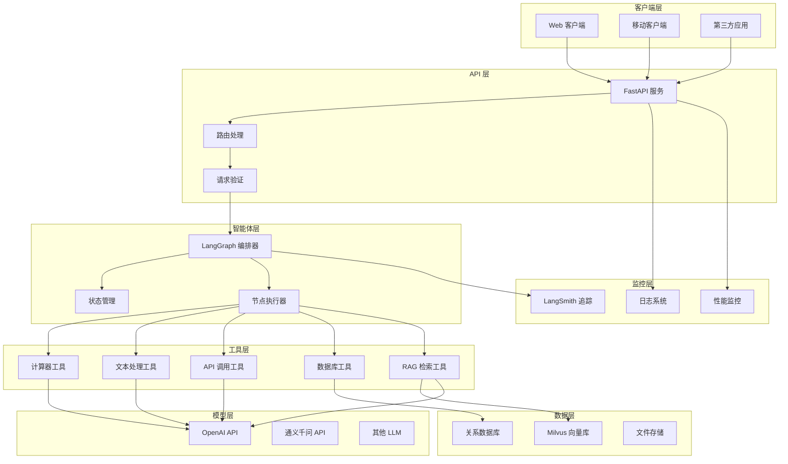
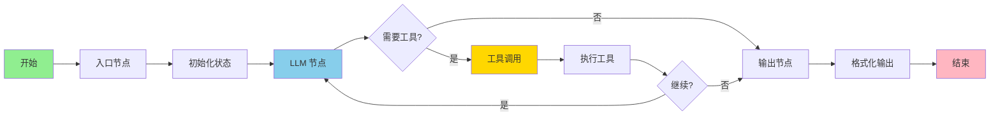
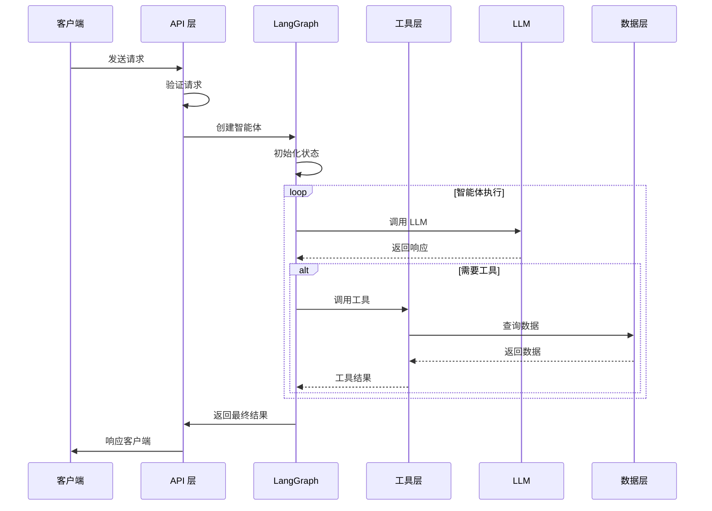
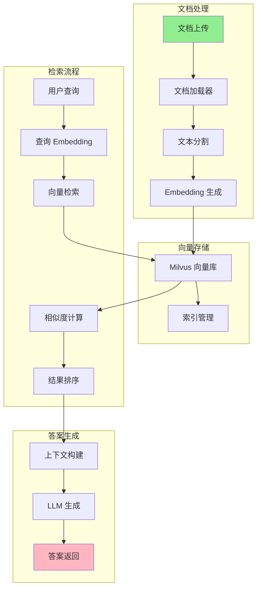
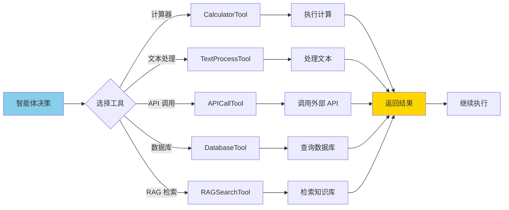
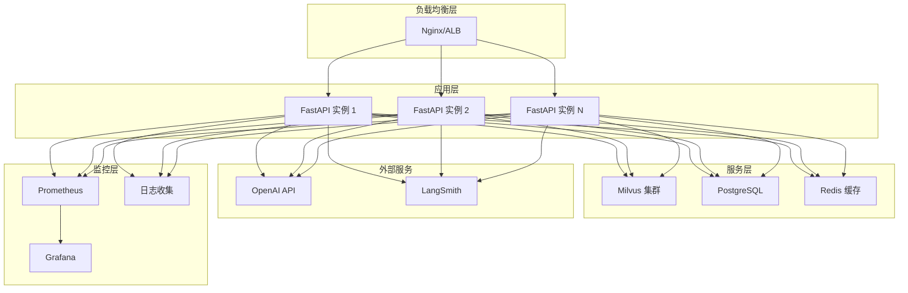
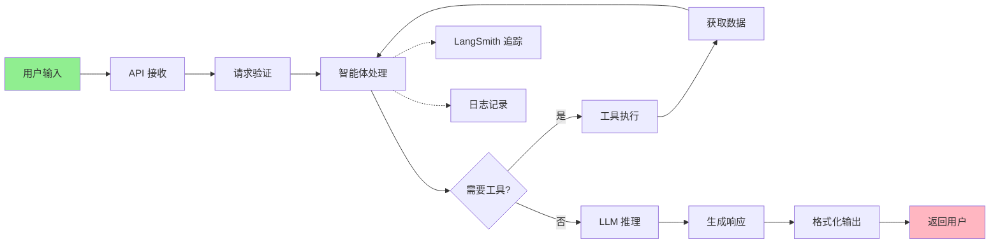
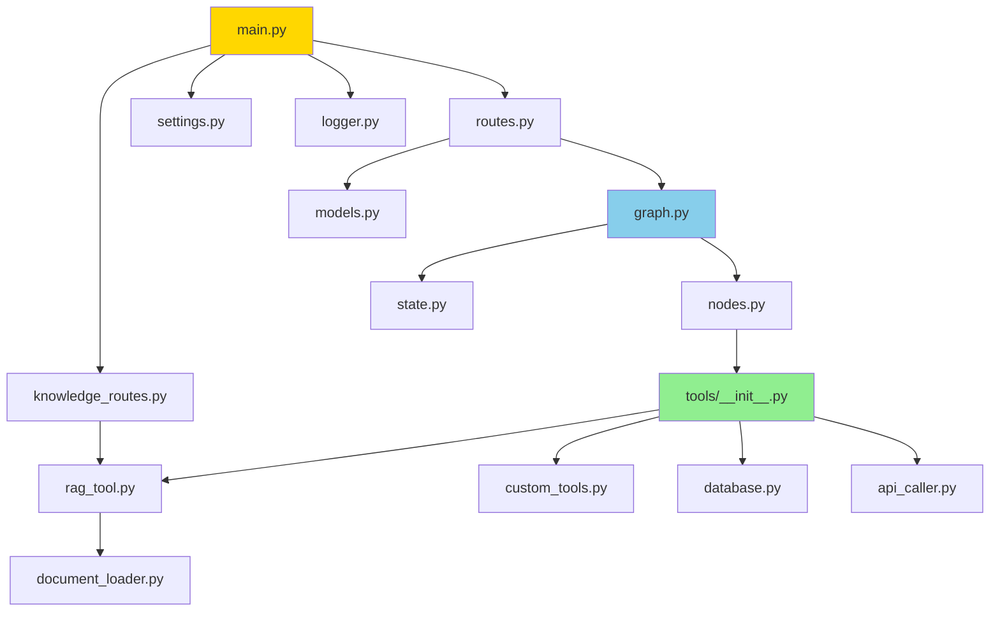
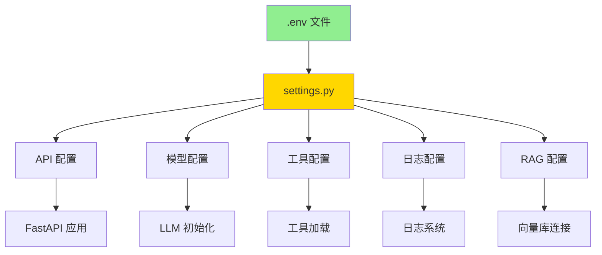

# 系统架构图

本文档使用 Mermaid 图表展示系统的各个架构层次。

## 整体架构

## LangGraph 执行流程

## 请求处理流程

## RAG 知识库架构

## 工具调用流程

## 部署架构

## 数据流图

## 模块依赖关系

## 配置管理

---

## 说明

以上图表展示了系统的主要架构和流程。你可以：

1. 在支持 Mermaid 的编辑器中查看（如 VS Code + Mermaid 插件）
2. 在 GitHub 上直接查看（GitHub 原生支持 Mermaid）
3. 使用在线工具如 [Mermaid Live Editor](https://mermaid.live/) 查看和编辑

## 相关文档

- [架构设计文档](architecture.md)
- [快速开始](quickstart.md)
- [部署指南](deployment.md)

