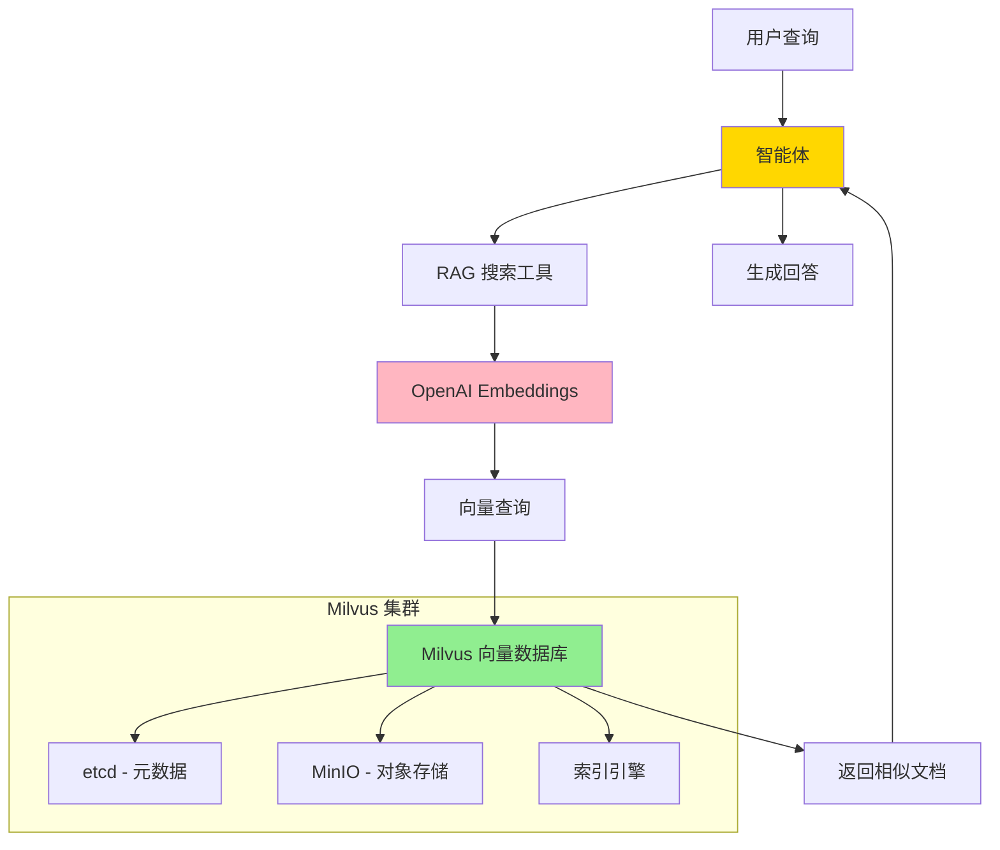

# RAG 知识库集成指南

## 📋 概述

本项目使用 **Milvus** 作为 RAG (Retrieval-Augmented Generation) 知识库的向量数据库。Milvus 是一个开源的高性能向量数据库,专为 AI 应用设计。

### 为什么选择 Milvus?

| 特性 | Milvus | Chroma | 说明 |
|------|--------|--------|------|
| **性能** | ⭐⭐⭐⭐⭐ | ⭐⭐⭐ | 毫秒级检索 vs 秒级 |
| **可扩展性** | ⭐⭐⭐⭐⭐ | ⭐⭐⭐ | 十亿级 vs 百万级向量 |
| **索引类型** | ⭐⭐⭐⭐⭐ | ⭐⭐⭐ | IVF, HNSW, DiskANN 等 |
| **分布式** | ⭐⭐⭐⭐⭐ | ⭐⭐ | 原生分布式支持 |
| **生产就绪** | ⭐⭐⭐⭐⭐ | ⭐⭐⭐ | 企业级 vs 小规模 |
| **监控** | ⭐⭐⭐⭐⭐ | ⭐⭐ | Prometheus + Grafana |

---

## 🏗️ 架构设计



---

## 🚀 快速开始 (3 步)

### 步骤 1: 启动 Milvus

#### 方式 1: 使用脚本 (推荐)

```bash
chmod +x scripts/start_milvus.sh
./scripts/start_milvus.sh
```

脚本会自动:
- ✅ 检查 Docker 是否安装
- ✅ 下载 Milvus Docker Compose 配置
- ✅ 启动 Milvus 服务
- ✅ 等待服务就绪
- ✅ 显示连接信息

#### 方式 2: 使用 Docker Compose

```bash
# 启动所有服务 (智能体 + Milvus)
docker-compose up -d

# 或只启动 Milvus 相关服务
docker-compose up -d milvus-etcd milvus-minio milvus-standalone
```

#### 方式 3: 手动启动 (单机版)

```bash
# 下载 Milvus Standalone 配置
wget https://github.com/milvus-io/milvus/releases/download/v2.3.3/milvus-standalone-docker-compose.yml -O docker-compose-milvus.yml

# 启动
docker-compose -f docker-compose-milvus.yml up -d
```

#### 验证 Milvus 是否启动

```bash
# 检查容器状态
docker ps | grep milvus

# 测试连接
curl http://localhost:9091/healthz
```

---

### 步骤 2: 配置环境变量

编辑 `.env` 文件,添加:

```env
# RAG 知识库配置
ENABLE_RAG_TOOL=true
RAG_VECTOR_DB_TYPE=milvus

# Milvus 配置
RAG_MILVUS_HOST=localhost
RAG_MILVUS_PORT=19530
RAG_MILVUS_COLLECTION=knowledge_base

# Embedding 配置
RAG_EMBEDDING_MODEL=text-embedding-ada-002
RAG_CHUNK_SIZE=500
RAG_CHUNK_OVERLAP=50
```

---

### 步骤 3: 启动服务

```bash
python run.py
```

服务启动后,RAG 工具会自动加载。

---

## 📚 Milvus 部署详解

### 部署架构

Milvus 有三种部署模式:

| 模式 | 说明 | 适用场景 |
|------|------|---------|
| **Standalone** | 单机模式 | 开发、测试、小规模生产 |
| **Cluster** | 集群模式 | 大规模生产环境 |
| **Cloud** | 云托管 | 无需运维的生产环境 |

### Standalone 模式 (推荐)

**组件**:
- **Milvus**: 向量数据库核心
- **etcd**: 元数据存储
- **MinIO**: 对象存储 (存储向量数据)

**端口**:
- `19530`: Milvus gRPC 端口
- `9091`: Milvus HTTP 端口 (健康检查)
- `2379`: etcd 端口
- `9000`: MinIO 端口

**资源要求**:
- CPU: 2 核+
- 内存: 4GB+
- 磁盘: 10GB+

### Docker Compose 配置

项目已包含完整的 Docker Compose 配置:

```yaml
# docker-compose.yml (Milvus 部分)
services:
  milvus-etcd:
    image: quay.io/coreos/etcd:v3.5.5
    environment:
      - ETCD_AUTO_COMPACTION_MODE=revision
      - ETCD_AUTO_COMPACTION_RETENTION=1000
    volumes:
      - ./volumes/etcd:/etcd

  milvus-minio:
    image: minio/minio:RELEASE.2023-03-20T20-16-18Z
    environment:
      MINIO_ACCESS_KEY: minioadmin
      MINIO_SECRET_KEY: minioadmin
    volumes:
      - ./volumes/minio:/minio_data
    command: minio server /minio_data

  milvus-standalone:
    image: milvusdb/milvus:v2.3.3
    command: ["milvus", "run", "standalone"]
    environment:
      ETCD_ENDPOINTS: milvus-etcd:2379
      MINIO_ADDRESS: milvus-minio:9000
    volumes:
      - ./volumes/milvus:/var/lib/milvus
    ports:
      - "19530:19530"
      - "9091:9091"
    depends_on:
      - milvus-etcd
      - milvus-minio
```

### 管理界面 (Attu)

Attu 是 Milvus 的可视化管理工具:

```bash
# 启动 Attu
docker run -d \
  --name milvus-attu \
  -p 3000:3000 \
  -e MILVUS_URL=milvus-standalone:19530 \
  zilliz/attu:latest
```

访问: http://localhost:3000

---

## 🔧 知识库管理

# 嵌入模型配置
RAG_EMBEDDING_MODEL=text-embedding-3-small
RAG_CHUNK_SIZE=1000
RAG_CHUNK_OVERLAP=200
RAG_TOP_K=5
```

### 步骤4: 启动服务

```bash
python run.py
```

你应该看到:

```
成功连接到 Milvus: localhost:19530
RAG知识库初始化完成: knowledge_base
成功加载 RAG 知识库工具
启动 智能体API服务 v1.0.0
```

### 步骤5: 测试

```bash
# 添加测试文本
curl -X POST http://localhost:8000/api/v1/knowledge/add-text \
  -H "Content-Type: application/json" \
  -d '{
    "text": "Milvus是一个开源的向量数据库，专为AI应用设计。"
  }'

# 搜索
curl -X POST http://localhost:8000/api/v1/knowledge/search \
  -d '{"query": "什么是Milvus?", "top_k": 3}'

# 通过智能体查询
curl -X POST http://localhost:8000/api/v1/chat \
  -d '{"message": "Milvus有什么特点?"}'
```

## 核心组件

### 1. Milvus 向量数据库

**特性**:
- 高性能向量检索
- 支持多种索引类型
- 分布式架构
- 云原生设计

**端口**:
- `19530`: gRPC 端口 (主要)
- `9091`: HTTP 端口 (健康检查、指标)

### 2. 嵌入模型

**默认**: OpenAI `text-embedding-3-small`

**可选**:
- `text-embedding-3-large` - 更高精度
- `text-embedding-ada-002` - 兼容性好
- 本地模型 (sentence-transformers)

### 3. 文档处理

**支持格式**:
- `.txt` - 纯文本
- `.md` - Markdown
- `.pdf` - PDF 文档
- `.docx` / `.doc` - Word 文档

**处理流程**:
1. 文档加载
2. 文本分割 (Chunk Size: 1000)
3. 向量化 (Embeddings)
4. 存储到 Milvus

## API 接口

### 知识库管理

| 端点 | 方法 | 描述 |
|------|------|------|
| `/api/v1/knowledge/upload` | POST | 上传文档 |
| `/api/v1/knowledge/add-text` | POST | 添加文本 |
| `/api/v1/knowledge/search` | POST | 搜索知识库 |
| `/api/v1/knowledge/stats` | GET | 统计信息 |
| `/api/v1/knowledge/clear` | DELETE | 清空知识库 |

### 智能体对话

| 端点 | 方法 | 描述 |
|------|------|------|
| `/api/v1/chat` | POST | 与智能体对话 |

## Milvus 管理

### 使用 Attu (Web UI)

Attu 是 Milvus 的官方 Web 管理界面。

**启动 Attu**:

```bash
# 使用 docker-compose 启动 (Attu 已包含)
docker-compose up -d milvus-attu

# 访问 http://localhost:8001

# 或单独启动
docker run -d \
  --name attu \
  -p 8001:3000 \
  -e MILVUS_URL=http://host.docker.internal:19530 \
  zilliz/attu:latest
```

**功能**:
- 查看集合和数据
- 执行向量搜索
- 管理索引
- 监控性能

### 使用 Python SDK

```python
from pymilvus import connections, Collection, utility

# 连接到 Milvus
connections.connect(
    alias="default",
    host="localhost",
    port=19530
)

# 列出所有集合
collections = utility.list_collections()
print(f"集合列表: {collections}")

# 获取集合信息
if "knowledge_base" in collections:
    collection = Collection("knowledge_base")
    collection.load()
    
    print(f"文档数量: {collection.num_entities}")
    print(f"索引信息: {collection.indexes}")

# 删除集合 (谨慎!)
# utility.drop_collection("knowledge_base")

# 断开连接
connections.disconnect("default")
```

### 常用命令

```bash
# 查看 Milvus 状态
curl http://localhost:9091/healthz

# 查看指标
curl http://localhost:9091/metrics

# 查看日志
docker logs -f milvus-standalone

# 停止 Milvus
docker stop milvus-standalone

# 启动 Milvus
docker start milvus-standalone

# 重启 Milvus
docker restart milvus-standalone

# 删除 Milvus (会删除数据!)
docker rm -f milvus-standalone
```

## 性能优化

### 1. 索引配置

Milvus 支持多种索引类型:

**HNSW** (推荐 - 高精度):
```python
index_params = {
    "metric_type": "L2",
    "index_type": "HNSW",
    "params": {"M": 16, "efConstruction": 256}
}
```

**IVF_FLAT** (平衡):
```python
index_params = {
    "metric_type": "L2",
    "index_type": "IVF_FLAT",
    "params": {"nlist": 128}
}
```

**IVF_PQ** (高性能):
```python
index_params = {
    "metric_type": "L2",
    "index_type": "IVF_PQ",
    "params": {"nlist": 128, "m": 8}
}
```

### 2. 搜索参数

```python
# 调整搜索参数以平衡速度和精度
search_params = {
    "metric_type": "L2",
    "params": {"ef": 64}  # 增加 ef 提高精度，降低速度
}
```

### 3. 资源配置

在 `.env` 或 docker-compose 中调整:

```yaml
standalone:
  environment:
    - MILVUS_CACHE_SIZE=4GB  # 增加缓存
  deploy:
    resources:
      limits:
        cpus: '4'
        memory: 8G
```

## 监控和维护

### 健康检查

```bash
# 检查 Milvus 健康状态
curl http://localhost:9091/healthz

# 应该返回: OK
```

### 查看指标

```bash
# Prometheus 格式的指标
curl http://localhost:9091/metrics | grep milvus
```

### 备份数据

```bash
# 备份 Milvus 数据目录
tar -czf milvus-backup-$(date +%Y%m%d).tar.gz volumes/milvus/

# 恢复
tar -xzf milvus-backup-20251002.tar.gz
```

### 日志管理

```bash
# 查看实时日志
docker logs -f milvus-standalone

# 导出日志
docker logs milvus-standalone > milvus.log 2>&1
```

## 故障排查

### 问题1: 连接失败

**症状**: `ConnectionError: failed to connect to Milvus`

**检查**:
```bash
# 1. 检查 Milvus 是否运行
docker ps | grep milvus

# 2. 检查端口
netstat -an | grep 19530

# 3. 查看日志
docker logs milvus-standalone

# 4. 测试连接
curl http://localhost:9091/healthz
```

### 问题2: 集合不存在

**症状**: `Collection 'knowledge_base' not found`

**解决**: 集合会在首次添加文档时自动创建，或手动创建:

```python
from pymilvus import connections, FieldSchema, CollectionSchema, DataType, Collection

connections.connect(host="localhost", port=19530)

# 定义字段
fields = [
    FieldSchema(name="id", dtype=DataType.INT64, is_primary=True, auto_id=True),
    FieldSchema(name="vector", dtype=DataType.FLOAT_VECTOR, dim=1536),
    FieldSchema(name="text", dtype=DataType.VARCHAR, max_length=65535)
]

# 创建集合
schema = CollectionSchema(fields, description="Knowledge base")
collection = Collection(name="knowledge_base", schema=schema)
```

### 问题3: 内存不足

**症状**: OOM 错误

**解决**:
```yaml
# 增加 Docker 内存限制
standalone:
  deploy:
    resources:
      limits:
        memory: 8G
```

## 生产环境部署

### 1. 使用 Milvus 集群

```bash
helm install milvus milvus/milvus \
  --set cluster.enabled=true \
  --set queryNode.replicas=2 \
  --set dataNode.replicas=2
```

### 2. 启用认证

```yaml
standalone:
  environment:
    - MILVUS_SECURITY_ENABLED=true
    - MILVUS_SECURITY_USERNAME=admin
    - MILVUS_SECURITY_PASSWORD=your_password
```

### 3. 配置监控

集成 Prometheus + Grafana:

```yaml
prometheus:
  image: prom/prometheus
  volumes:
    - ./prometheus.yml:/etc/prometheus/prometheus.yml
  ports:
    - "9090:9090"

grafana:
  image: grafana/grafana
  ports:
    - "3000:3000"
```

### 4. 数据持久化

确保数据目录持久化:

```yaml
volumes:
  - /data/milvus:/var/lib/milvus
```

## 参考资源

- [Milvus 部署指南](./milvus_deployment.md)
- [Milvus 官方文档](https://milvus.io/docs)
- [Attu 管理界面](https://github.com/zilliztech/attu)
- [性能调优指南](https://milvus.io/docs/performance_tuning.md)

## 下一步

- [ ] 部署 Milvus
- [ ] 配置智能体
- [ ] 上传文档
- [ ] 测试查询
- [ ] 配置监控
- [ ] 优化性能

