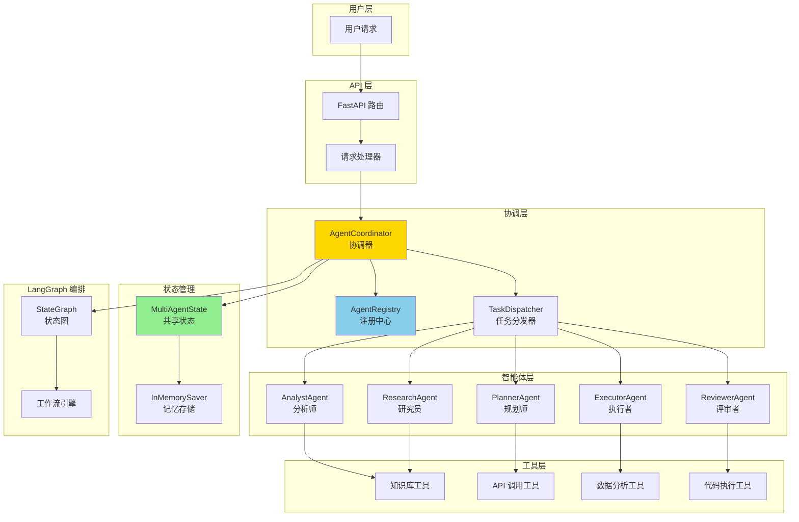
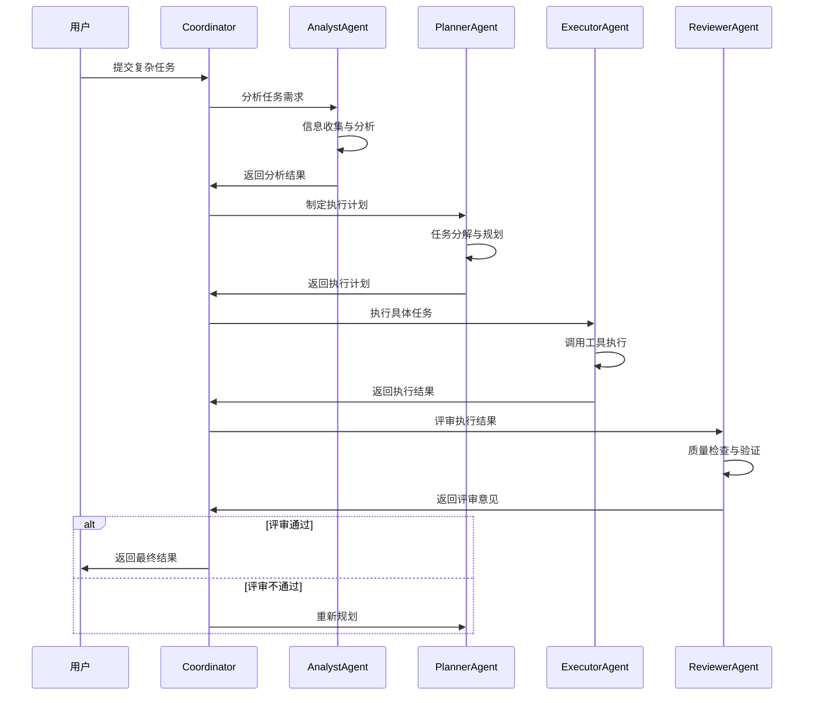
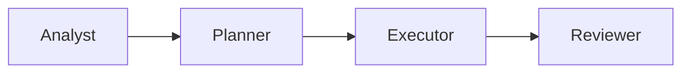
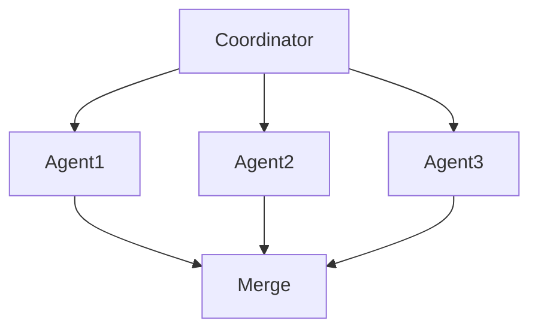
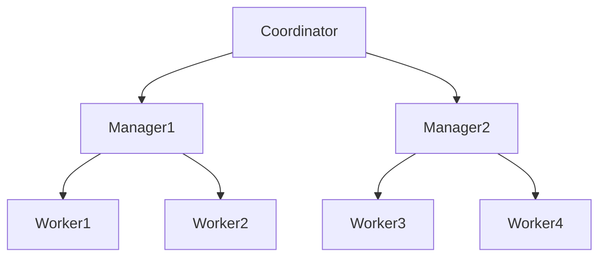
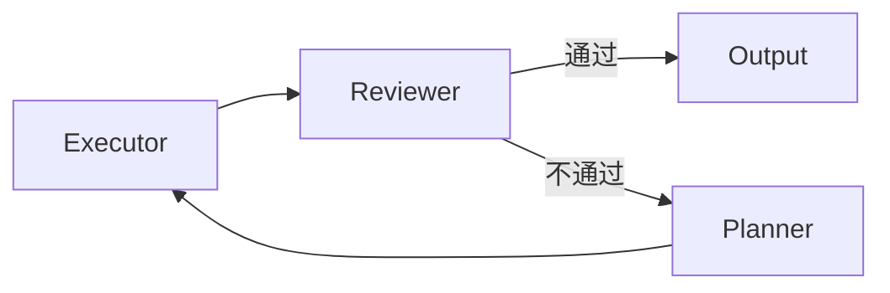

# 多智能体架构设计方案

## 📋 概述

本文档描述基于 TradingAgents-CN 设计理念的多智能体系统架构,为 cus-ai-agent 项目提供多智能体协作能力。

### 设计目标

- 🤖 **专业分工**: 每个智能体专注于特定领域,提高任务处理质量
- 🔄 **协作机制**: 智能体之间通过消息传递和状态共享进行协作
- 📊 **可扩展性**: 支持动态添加新的智能体类型
- 🎯 **任务编排**: 使用 LangGraph 实现复杂的多智能体工作流
- 🔍 **可观测性**: 完整的执行追踪和调试能力

### 参考架构

参考 TradingAgents-CN 的多智能体设计:
- **分析师(Analyst)**: 负责信息分析和洞察提取
- **规划师(Planner)**: 负责任务规划和策略制定
- **执行者(Executor)**: 负责具体任务执行
- **评审者(Reviewer)**: 负责结果评审和质量控制
- **协调者(Coordinator)**: 负责智能体间的协调和调度

---

## 🏗️ 系统架构

### 整体架构图



### 协作流程图



---

## 🧩 核心组件

### 1. BaseAgent (智能体基类)

所有智能体的基类,定义通用接口和行为。

**核心属性**:
- `agent_id`: 智能体唯一标识
- `agent_type`: 智能体类型
- `name`: 智能体名称
- `description`: 智能体描述
- `capabilities`: 智能体能力列表
- `llm`: 大语言模型实例
- `tools`: 可用工具列表

**核心方法**:
- `process(state)`: 处理任务的主方法
- `analyze(input)`: 分析输入
- `execute(task)`: 执行任务
- `validate(result)`: 验证结果

### 2. AgentRegistry (智能体注册中心)

管理所有智能体的注册、发现和生命周期。

**功能**:
- 智能体注册与注销
- 智能体查询与发现
- 智能体状态管理
- 智能体能力匹配

### 3. AgentCoordinator (协调器)

负责多智能体间的协调、任务分配和结果聚合。

**功能**:
- 任务分析与分解
- 智能体选择与调度
- 执行流程控制
- 结果聚合与优化

### 4. MultiAgentState (多智能体状态)

多智能体系统的共享状态,继承自 AgentState。

**状态字段**:
```python
class MultiAgentState(TypedDict):
    # 基础字段
    messages: List[BaseMessage]
    session_id: str
    
    # 任务相关
    task: Dict[str, Any]  # 当前任务
    task_plan: List[Dict]  # 任务计划
    
    # 智能体相关
    current_agent: str  # 当前执行的智能体
    agent_results: Dict[str, Any]  # 各智能体的结果
    agent_history: List[Dict]  # 智能体执行历史
    
    # 协作相关
    coordination_mode: str  # 协作模式: sequential/parallel/hierarchical
    next_agent: Optional[str]  # 下一个智能体
    
    # 结果相关
    intermediate_results: List[Dict]  # 中间结果
    final_result: Optional[Dict]  # 最终结果
    
    # 元数据
    metadata: Dict[str, Any]
    is_finished: bool
```

---

## 🤖 专业智能体

### 1. AnalystAgent (分析师)

**职责**: 信息收集、数据分析、洞察提取

**能力**:
- 需求分析
- 信息检索
- 数据分析
- 趋势识别

**工具**:
- 知识库检索工具
- 数据分析工具
- 网络搜索工具

### 2. PlannerAgent (规划师)

**职责**: 任务分解、策略制定、计划优化

**能力**:
- 任务分解
- 策略规划
- 资源分配
- 风险评估

**工具**:
- 规划算法工具
- 优化工具

### 3. ExecutorAgent (执行者)

**职责**: 具体任务执行、工具调用、结果生成

**能力**:
- 工具调用
- 代码执行
- API 调用
- 文件操作

**工具**:
- 所有可用工具
- 代码执行环境

### 4. ReviewerAgent (评审者)

**职责**: 结果验证、质量检查、改进建议

**能力**:
- 结果验证
- 质量评估
- 错误检测
- 改进建议

**工具**:
- 验证工具
- 测试工具

### 5. ResearchAgent (研究员)

**职责**: 深度研究、知识整合、报告生成

**能力**:
- 深度研究
- 知识整合
- 文档生成
- 引用管理

**工具**:
- 知识库工具
- 文档生成工具

---

## 🔄 协作模式

### 1. 顺序协作 (Sequential)

智能体按顺序依次执行,前一个的输出作为后一个的输入。



**适用场景**: 任务有明确的执行顺序,后续步骤依赖前面的结果。

### 2. 并行协作 (Parallel)

多个智能体同时执行不同的子任务,最后聚合结果。



**适用场景**: 子任务相互独立,可以并行处理以提高效率。

### 3. 层级协作 (Hierarchical)

协调者分配任务给下级智能体,下级智能体可以进一步分配给更下级。



**适用场景**: 复杂任务需要多层次的管理和执行。

### 4. 反馈协作 (Feedback Loop)

智能体之间形成反馈循环,不断优化结果。



**适用场景**: 需要迭代优化的任务,如代码生成、文档撰写等。

---

## 📊 LangGraph 工作流

### 多智能体状态图

```python
from langgraph.graph import StateGraph, END

# 创建状态图
workflow = StateGraph(MultiAgentState)

# 添加智能体节点
workflow.add_node("coordinator", coordinator_node)
workflow.add_node("analyst", analyst_node)
workflow.add_node("planner", planner_node)
workflow.add_node("executor", executor_node)
workflow.add_node("reviewer", reviewer_node)

# 设置入口
workflow.set_entry_point("coordinator")

# 添加条件边
workflow.add_conditional_edges(
    "coordinator",
    route_to_agent,
    {
        "analyst": "analyst",
        "planner": "planner",
        "executor": "executor",
        "reviewer": "reviewer",
        "end": END
    }
)

# 添加返回边
workflow.add_edge("analyst", "coordinator")
workflow.add_edge("planner", "coordinator")
workflow.add_edge("executor", "coordinator")
workflow.add_edge("reviewer", "coordinator")

# 编译
multi_agent_graph = workflow.compile()
```

---

## 🛠️ 实现计划

### 阶段 1: 核心框架 (Week 1)
- [ ] 实现 BaseAgent 基类
- [ ] 实现 AgentRegistry 注册中心
- [ ] 实现 AgentCoordinator 协调器
- [ ] 定义 MultiAgentState 状态

### 阶段 2: 专业智能体 (Week 2)
- [ ] 实现 AnalystAgent
- [ ] 实现 PlannerAgent
- [ ] 实现 ExecutorAgent
- [ ] 实现 ReviewerAgent
- [ ] 实现 ResearchAgent

### 阶段 3: 协作机制 (Week 3)
- [ ] 实现顺序协作模式
- [ ] 实现并行协作模式
- [ ] 实现层级协作模式
- [ ] 实现反馈协作模式

### 阶段 4: LangGraph 集成 (Week 4)
- [ ] 创建多智能体状态图
- [ ] 实现路由逻辑
- [ ] 集成 InMemorySaver
- [ ] 添加可观测性

### 阶段 5: API 和文档 (Week 5)
- [ ] 创建 REST API 接口
- [ ] 编写使用文档
- [ ] 创建示例代码
- [ ] 编写测试用例

---

## 📝 使用示例

### 示例 1: 复杂问题分析

```python
# 用户请求
request = {
    "task": "分析并制定市场营销策略",
    "context": "新产品上市",
    "requirements": ["市场分析", "竞品分析", "策略建议"]
}

# 执行流程
# 1. Coordinator 接收任务
# 2. AnalystAgent 分析市场和竞品
# 3. PlannerAgent 制定营销策略
# 4. ReviewerAgent 评审策略
# 5. 返回最终结果
```

### 示例 2: 代码生成与优化

```python
# 用户请求
request = {
    "task": "生成并优化 Python 函数",
    "requirements": "实现快速排序算法"
}

# 执行流程
# 1. PlannerAgent 分解任务
# 2. ExecutorAgent 生成代码
# 3. ReviewerAgent 检查代码质量
# 4. ExecutorAgent 根据反馈优化
# 5. 循环直到通过评审
```

---

## 🔍 监控与调试

### LangSmith 集成

所有智能体执行都会被 LangSmith 追踪:
- 智能体调用链路
- 执行时间统计
- 工具调用记录
- 错误追踪

### 日志记录

每个智能体都会记录详细日志:
- 任务接收
- 处理过程
- 工具调用
- 结果输出

---

## 🚀 下一步

1. 实现核心框架代码
2. 创建专业智能体
3. 实现协作机制
4. 集成 LangGraph
5. 创建 API 接口
6. 编写测试和文档

